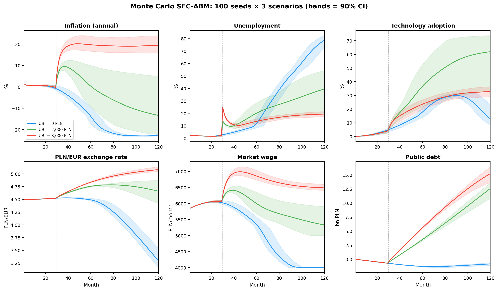
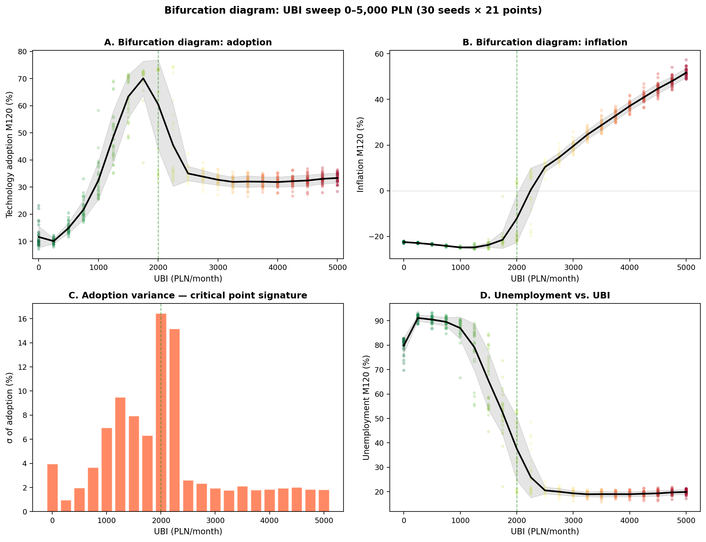
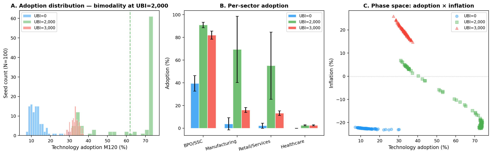
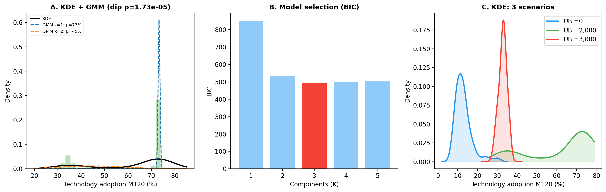
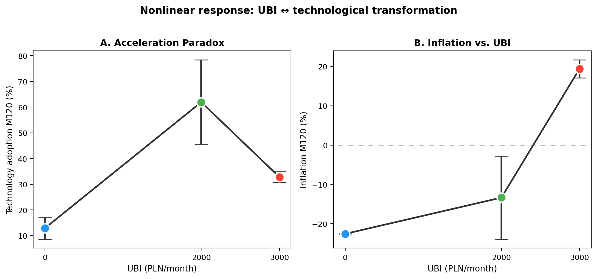
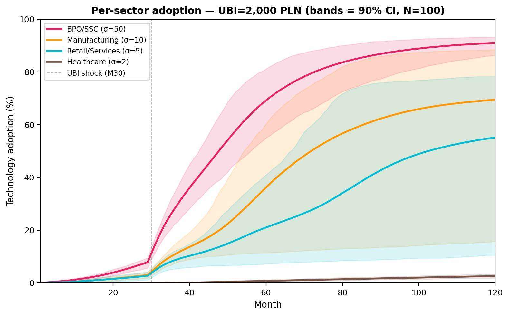
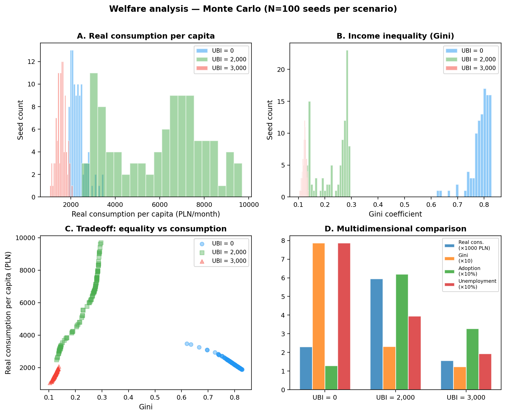
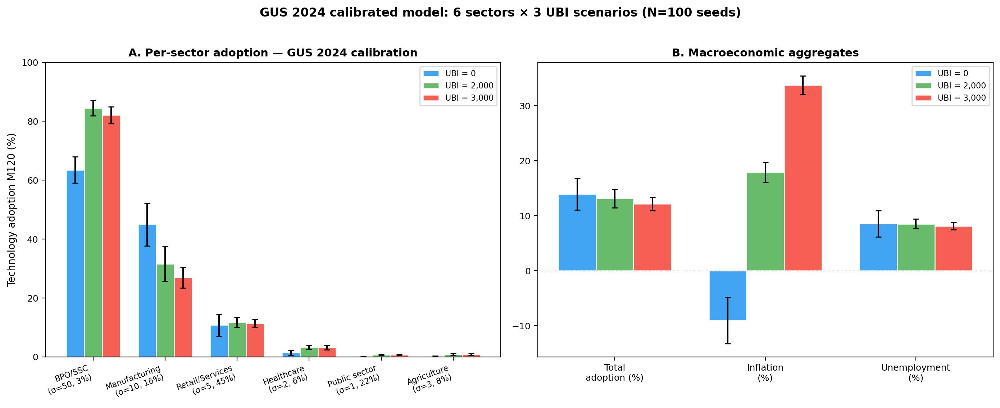
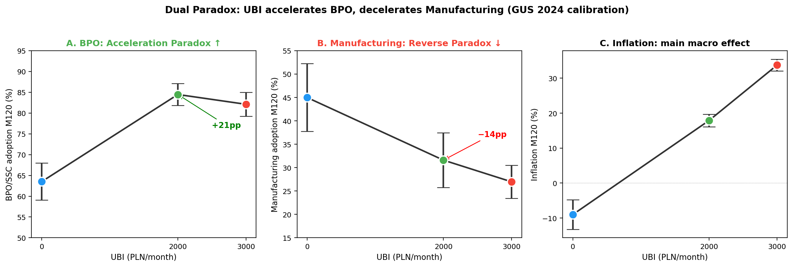

# The Acceleration Paradox

[](https://doi.org/10.5281/zenodo.18727928)
[**Read the paper (PDF)**](latex/paper_en.pdf)

**UBI as Automation Catalyst in a Small Open Economy: An SFC-ABM Approach**

Mateusz Maciaszek, 2026

## Abstract

We reverse the standard causality: Universal Basic Income does not respond to automation — it *causes* it. Through a double cost shock (rising reservation wages + rising interest rates), UBI makes labor-intensive business models mathematically unsustainable, forcing firms into a nonlinear technological leap. The resulting "Endogenous Technological Deflation" — where AI-driven productivity growth outpaces monetary expansion — resolves the inflationary dilemma of Modern Monetary Theory.

## Key Results

| Metric | UBI = 0 PLN | UBI = 2 000 PLN | UBI = 3 000 PLN |
|--------|:-----------:|:---------------:|:---------------:|
| AI + Hybrid adoption | 12.9% | 61.9% ± 16.4% | 32.8% |
| Inflation (r/r) | −22.6% | −13.4% | +19.4% |
| Unemployment | 78.7% | 39.6% | 19.4% |
| Exchange rate PLN/EUR | 3.29 | 4.66 | 5.08 |
| Market wage | 4 000 PLN | 5 331 PLN | 6 487 PLN |
| Public debt | −0.83 mld | 12.58 mld | 15.23 mld |

**Bimodality** at UBI = 2 000 PLN confirmed (Hartigan dip test: p = 1.7 × 10⁻⁵), indicating a phase transition with three attractor states identified by GMM (K=3, BIC-optimal).

## Model

- **SFC-ABM**: 10 000 heterogeneous firms across 6 sectors (GUS 2024 calibration)
- **Network**: Watts-Strogatz small-world (k=6, p=0.10) — demonstration effect diffusion
- **Monte Carlo**: 100 seeds × 3 scenarios × 120 months
- **Balance sheets**: Full stock-flow consistency across 6 accounting blocks
- **Sectors**: BPO/SSC (σ=50), Manufacturing (σ=10), Retail/Services (σ=5), Healthcare (σ=2), Agriculture (σ=3), Public (σ=1)

## Structure

```
├── simulations/
│   ├── scala/
│   │   └── simulation_mc.sc      # Ammonite SFC-ABM simulation (865 lines)
│   ├── scripts/
│   │   └── run_sweep.sh          # Parameter sweep runner (21 UBI levels)
│   └── results/
│       ├── baseline_*.csv        # UBI = 2 000 PLN (N=100)
│       ├── nobdp_*.csv           # UBI = 0 PLN (N=100)
│       ├── bdp3000_*.csv         # UBI = 3 000 PLN (N=100)
│       ├── gus/                  # GUS-calibrated runs
│       └── sweep/                # 21-point parameter sweep (0–5 000 PLN)
├── analysis/
│   └── python/
│       ├── mc_charts.py          # Main Monte Carlo panel (6 subplots)
│       ├── mc_welfare.py         # Welfare analysis charts
│       ├── sweep_analysis.py     # Bifurcation diagram + inverted-U
│       ├── diptest_analysis.py   # Hartigan dip test + GMM bimodality
│       └── gus_charts.py         # GUS dual paradox + sector comparison
├── figures/                      # 9 generated plots (PNG)
├── latex/
│   ├── esej.tex                  # Paper source (XeLaTeX + biblatex)
│   ├── esej.pdf                  # Compiled paper (~50 pages)
│   ├── references.bib            # Bibliography
│   └── figures/                  # Figures embedded in paper
├── Makefile
└── LICENSE
```

## Reproduce

### Prerequisites

- [Ammonite](https://ammonite.io/) (Scala scripting)
- Python 3 + matplotlib, seaborn, scipy, scikit-learn, pandas
- XeLaTeX + biblatex (for paper compilation)

### Run

```bash
# Full pipeline: simulation → figures → paper
make all

# Or step by step:
make simulate    # ~45 min (3 × 100 seeds × 10 000 firms × 120 months)
make figures     # Generate all plots from CSVs
make paper       # Compile LaTeX → PDF
```

### Quick single run

```bash
cd simulations/scala
BDP=2000 SEEDS=10 PREFIX=quick amm simulation_mc.sc
```

## Figures

### Monte Carlo Panel


**Main panel.** Six macroeconomic variables across 120 months for three UBI scenarios (0, 2000, 3000 PLN). Mean lines with 90% confidence bands over 100 seeds. The shock at month 30 triggers fundamentally different trajectories depending on UBI level.

### Bifurcation Diagram


**Bifurcation across 21 UBI levels.** Four panels: adoption, inflation, adoption variance, and unemployment vs BDP. The variance peak at BDP = 2000 PLN marks the critical point of the phase transition.

### Bimodality Analysis


**Phase transition evidence.** Adoption histogram shows a bimodal distribution at UBI = 2000 PLN (three attractor states via GMM, K=3). Per-sector bars reveal BPO/SSC and Manufacturing respond in opposite directions. Phase space scatter confirms regime separation.


**Formal bimodality test.** Hartigan dip test rejects unimodality (p = 1.7 × 10⁻⁵). BIC model selection identifies K=3 as optimal. KDE overlay shows bimodality is unique to the critical UBI level.

### Nonlinear Response


**The Acceleration Paradox in two panels.** Adoption vs UBI shows an inverted-U — moderate UBI maximizes automation, while higher UBI triggers inflation that chokes investment. This is the core finding of the paper.

### Sector Dynamics


**Per-sector adoption trajectories** at UBI = 2000 PLN. BPO/SSC (σ=50) races to near-complete automation while Manufacturing (σ=10) stalls — the double cost shock hits high-elasticity sectors hardest.

### Welfare Analysis


**Welfare trade-offs.** Real consumption, Gini coefficient, and a composite dashboard across scenarios. UBI = 2000 achieves the highest productivity but at the cost of maximum inequality at the transition point.

### GUS Calibration


**GUS 2024 sector structure.** All 6 sectors including Public and Agriculture. The 45% weight of Retail/Services (σ=5) in the Polish economy dampens aggregate adoption compared to the simplified 4-sector model.


**The Dual Paradox.** BPO/SSC accelerates (+21 pp) while Manufacturing decelerates (-14 pp) under the same UBI. The inflation channel explains the divergence: high-σ sectors benefit from cost pressure, low-σ sectors are crushed by it.

## Related

- [Paper-02: Monetary Regimes](https://github.com/complexity-econ/paper-02-monetary-regimes)
- [Paper-03: Empirical σ Estimation](https://github.com/complexity-econ/paper-03-empirical-sigma)
- [Paper-04: Phase Diagram & Universality](https://github.com/complexity-econ/paper-04-phase-diagram)
- [Paper-05: Endogenous Technology & Networks](https://github.com/complexity-econ/paper-05-endogenous)
- [Core engine](https://github.com/complexity-econ/core)

## License

MIT
